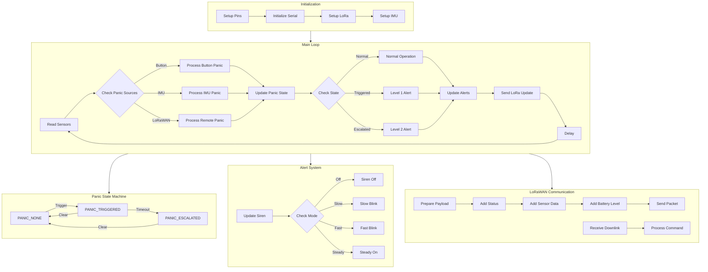

# SOS Client System Flow Chart

> **Viewing Instructions:**
> - Install the "Markdown Preview Enhanced" extension in VS Code
> - Press `Ctrl+K V` to open preview
> - Or use `Ctrl+Shift+V` for side-by-side preview
> - The Mermaid diagram below will automatically render in the preview

